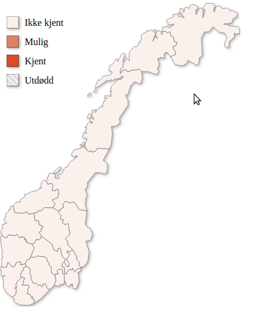

# SVG Shape Selector

Display a clickable SVG with customizable states (React)

## Example
After moving the package to @artsdatabanken/svg-shape-selector the example project has not been modified to work with React 18. This might be fixed once the need for it arises.

Inside the example directory run `npm install` and then `npm start`.

Open [http://localhost:1234](http://localhost:1234) to view it in the browser.

## Updating package
In order to update the NPM package, you will have to manually increment the version number specified in package.json. Once it is merged to the master branch the new npm package will be automagically published.